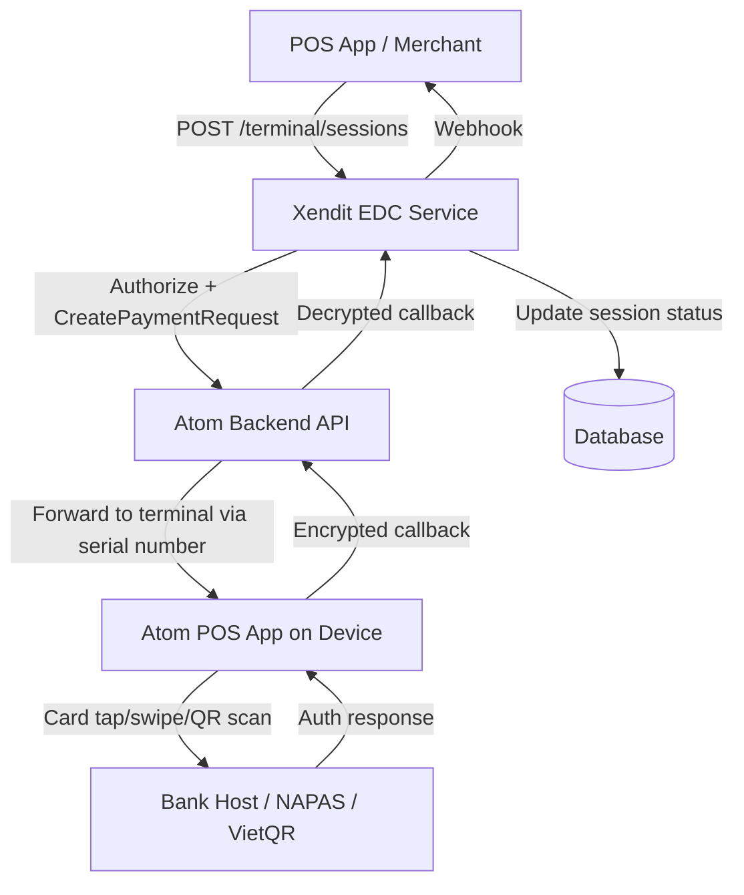
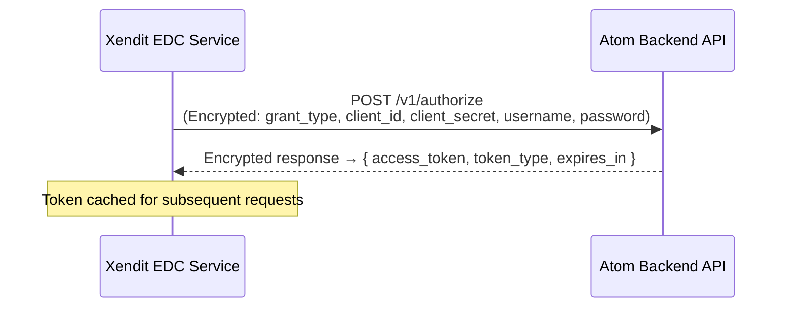
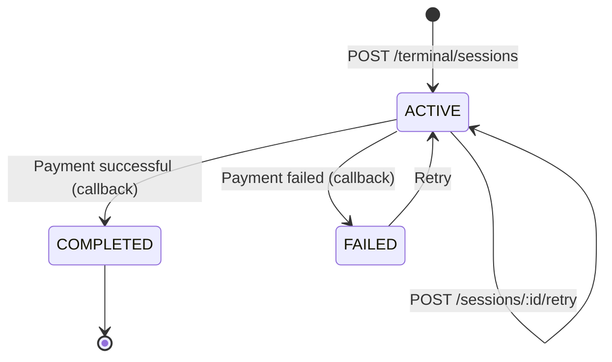
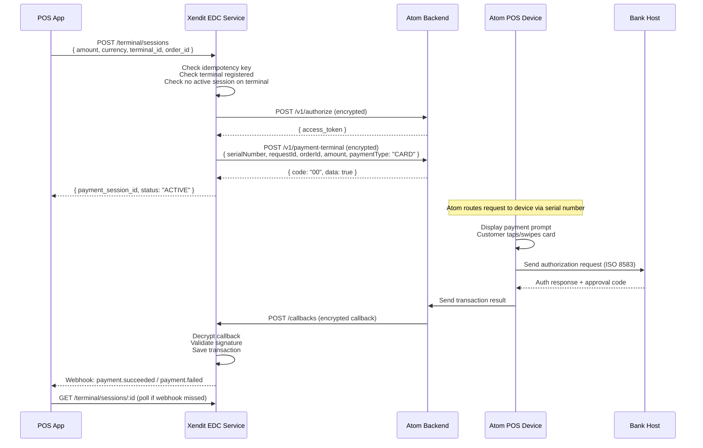
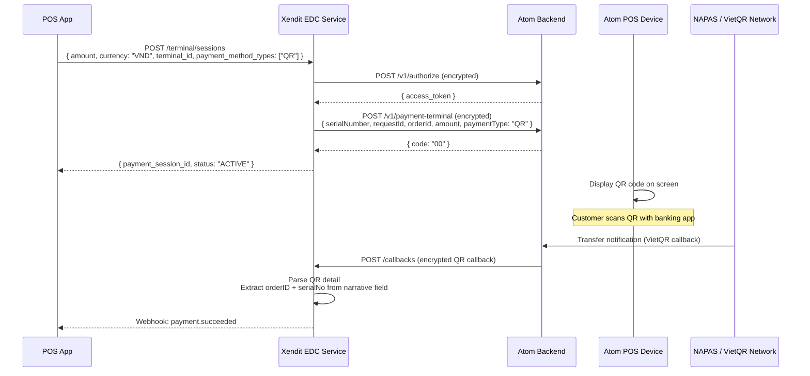
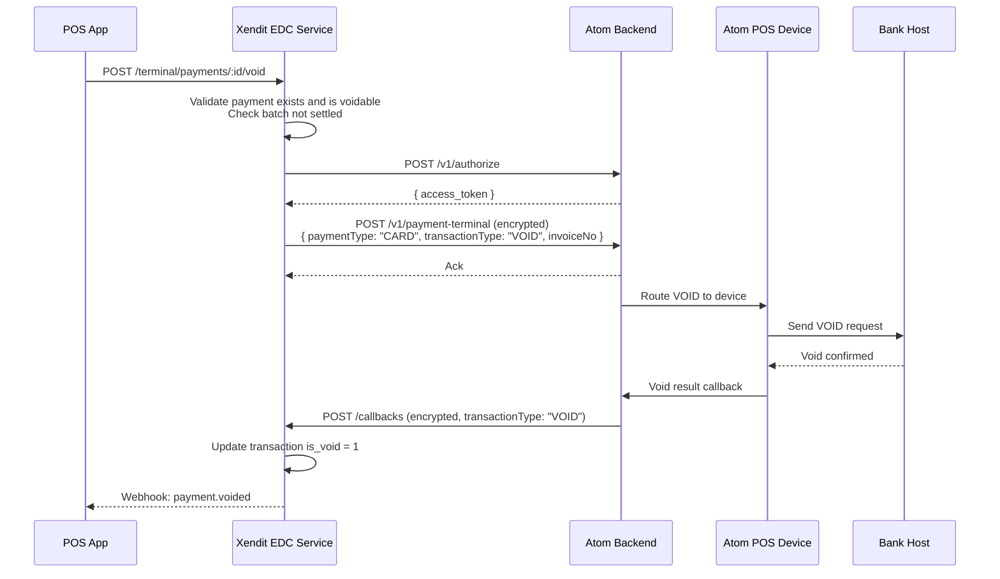
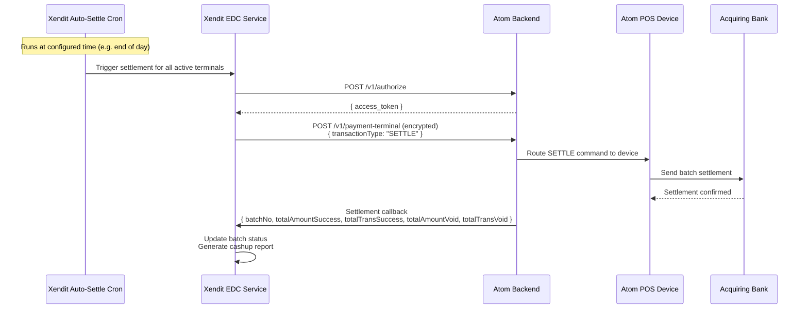
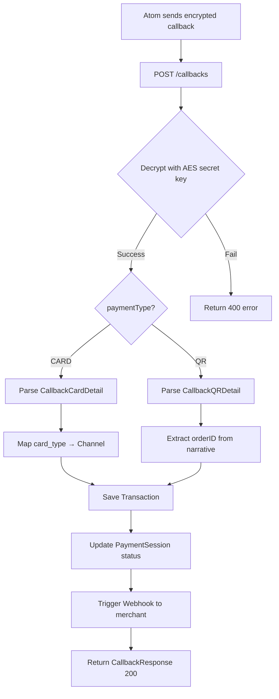

## Overview

Xendit's Vietnam EDC integration uses **Atom Solution** (`atomsolution.vn`) as the payment processor for card and QR transactions. The integration involves three layers:

| Layer | Component | Role |
|---|---|---|
| **Merchant App** | POS Application | Initiates payment sessions via Xendit API |
| **Xendit Backend** | `edc-service` | Orchestrates payment requests, stores state, sends webhooks |
| **Terminal** | Atom POS Application | Processes card/QR on physical EDC device |

---

## Architecture



---

## Authentication with Atom

Xendit authenticates with Atom's backend before each payment request. Atom uses **OAuth2 Client Credentials** with AES-256-CBC encrypted payloads.



### Encryption

All Atom API requests/responses are encrypted with **AES-256-CBC + PKCS7 padding**:

```
Payload → JSON → AES-256-CBC encrypt (random IV) → hex encode → send as "data" field
Response "data" field → hex decode → AES-256-CBC decrypt → JSON parse
```

- **Key:** AES secret key (hex string, 32 bytes = 256-bit)
- **IV:** Random 16 bytes prepended to ciphertext
- **Wire format:** `hex(IV + ciphertext)`

---

## Payment Session Lifecycle



| Status | Description |
|---|---|
| `ACTIVE` | Session created, waiting for terminal to process |
| `COMPLETED` | Payment successful, `payment_id` available |
| `FAILED` | Payment failed — safe to retry |

---

## Card Payment Flow (SALE)



### Card Callback Payload (Decrypted)

```json
{
  "requestID": "ps-abc123",
  "orderID": "order-001",
  "amount": "100000",
  "tip": "0",
  "paymentType": "CARD",
  "transactionType": "SALE",
  "serialNumber": "EDC001234",
  "status": "SUCCESS",
  "detailTransaction": {
    "txn_id": "TXN001",
    "serial_no": "EDC001234",
    "tid": "12345678",
    "mid": "MID001",
    "batch_no": "000001",
    "auth_id_response": "703336",
    "retrieval_ref_no": "413054665138",
    "card_no": "942147****4567",
    "card_type": "VISA",
    "card_origin": "1",
    "amount": "100000",
    "tip": "0",
    "invoice_no": "000008",
    "trace_no": "000007",
    "transaction_type": "SALE",
    "response_code": "00",
    "created_unix_time": 1710000000,
    "is_settle": 0,
    "is_void": 0
  }
}
```

**Card origin mapping:**
- `"0"` → Domestic (Local)
- `"1"` → International (Foreign)
- `"2"` → Unknown

**Card type → Channel mapping:**

| Atom `card_type` | Xendit Channel | Transaction Type |
|---|---|---|
| `VISA` | VISA | Credit Card |
| `MASTERCARD` | MASTERCARD | Credit Card |
| `JCB` | JCB | Credit Card |
| `AMEX` | AMEX | Credit Card |
| `UNION_PAY` | UNION_PAY | Credit Card |
| `NAPAS` | NAPAS | Debit Card |

---

## QR Payment Flow (VietQR)



### QR Callback Payload (Decrypted)

```json
{
  "requestID": "ps-abc123",
  "orderID": "order-001",
  "amount": "100000",
  "paymentType": "QR",
  "transactionType": "SALE",
  "serialNumber": "EDC001234",
  "status": "SUCCESS",
  "detailTransaction": {
    "externalRefNo": "EXT001",
    "trnRefNo": "TRN001",
    "accNo": "1234567890",
    "lcyAmount": "100000",
    "narrative": "order-001 EDC001234",
    "fromAccNo": "9876543210",
    "fromAccName": "NGUYEN VAN A",
    "fromBankCode": "970436",
    "fromBankName": "Vietcombank",
    "napasTraceId": "NAPAS001",
    "serialNumber": "EDC001234",
    "txnInitDt": "2026-03-19T10:00:00Z"
  }
}
```

<Note>
  For QR callbacks, `orderID` and `serialNumber` are extracted from the `narrative` field in format: `"{orderID} {serialNo}"`. Ensure your `orderId` does not contain spaces.
</Note>

---

## Void Flow

Void cancels a previously completed SALE transaction within the same batch.



<Warning>
  Atom does **not** send a `CANCELLED` status or cancel webhook. If the customer cancels at the terminal, Xendit will only know via timeout — implement server-side session expiry (120-180s) and manual cancel endpoint.
</Warning>

---

## Settlement Flow

Settlement clears the batch and sends all transactions to the acquiring bank.



### Settlement Response Data

```json
{
  "batchNo": "000001",
  "bankCode": "970454",
  "terminalId": "12345678",
  "merchantId": "MID001",
  "totalAmountSuccess": "500000",
  "totalTransSuccess": "5",
  "totalAmountVoid": "100000",
  "totalTransVoid": "1",
  "totalAmountRefund": "0",
  "totalTransRefund": "0",
  "isoResponseCode": "00"
}
```

---

## Atom POS Commands Reference

These are additional commands sent via Android Intent (C2C local integration) from POS App to Atom POS App:

| `tranxType` | Description | Key Response Fields |
|---|---|---|
| `SALE` | Process card payment | `approveCode`, `refNo`, `cardNo`, `cardType`, `invoiceNo`, `traceNo` |
| `VOID` | Cancel a transaction | `invoiceNo` required in request |
| `SETTLE` | Batch settlement | `totalAmountSuccess`, `batchNo` |
| `INITIALIZE` | Init/refresh terminal params | No response data |
| `LOGON` | Re-authenticate terminal with bank | No response data |
| `CHECK_TRANSACTION` | Query unsettled transaction | Full transaction detail |
| `CHECK_SETTLEMENT` | Query batch settlement status | `isClearBatch`, totals |
| `PRNT_LAST_TRANX` | Reprint last receipt | No response data |
| `PRNT_TRANX` | Print specific receipt by invoiceNo | No response data |
| `PRNT_SETTLE` | Reprint last settlement | No response data |

### Android Intent Pattern

```kotlin
// Send to Atom POS
val intent = Intent("atom.appbank.navigator")
intent.putExtra("SECRET_KEY", secretKey)
intent.putExtra("REQUEST_DATA", dataSendRequest.toJson())
startActivityForResult(intent, RESULT_CODE)

// Receive result
override fun onActivityResult(requestCode: Int, resultCode: Int, data: Intent?) {
    if (requestCode == RESULT_CODE) {
        val response = data?.getStringExtra("RESULT") // JSON string
    }
}
```

---

## Callback Endpoint

Atom sends encrypted callbacks to Xendit EDC Service. Xendit exposes two callback endpoints:

| Endpoint | Auth | Usage |
|---|---|---|
| `POST /internal/callbacks` | API Key | For internal/Atom callbacks |
| `POST /public/callbacks` | None (validated by payload) | For public-facing callbacks |

### Callback Processing Flow



---

## Error Codes

### Atom API Error Codes

| Code | Constant | Description |
|---|---|---|
| `00` | `CodeSuccess` | Success |
| `01` | `CodeAuthenticateError` | Authentication failed |
| `02` | `CodeURLNotFound` | URL not found |
| `03` | `CodeMissingFieldError` | Missing required field |
| `04` | `CodeInvalidFieldError` | Invalid field value |
| `05` | `CodeUnauthorizedError` | Unauthorized |
| `06` | `CodeAccessDenied` | Access denied |
| `07` | `CodeConnectPOSError` | Cannot connect to POS device |
| `08` | `CodeEncryptionError` | Encryption/decryption error |

### Atom POS Response Codes (Android Intent)

| Code | Meaning |
|---|---|
| `200` | Success |
| `209` | Timeout from EDC device |
| `210` | Timeout from bank host |
| `211` | Transaction cancelled by user |
| `219` | Unknown error |
| `220` | Must settle batch first |
| `227` | Network error |
| `229` | Transaction failed |
| `413` | Invalid secret key |

### ISO Response Codes

| ISO Code | Meaning |
|---|---|
| `00` | Success |
| `05` | Do not honour |
| `12` | Invalid transaction |
| `17` | Customer cancelled |
| `55` | Incorrect PIN |
| `91` | Issuer bank unavailable |
| `94` | Transaction voided |
| `Z3` | Timeout |

---

## Key Implementation Notes

<CardGroup cols={2}>
  <Card title="Idempotency" icon="key">
    Each payment session must have a unique `idempotency_key`. Duplicate sessions on the same terminal are rejected — only one active session per terminal at a time.
  </Card>
  <Card title="AES Encryption" icon="lock">
    All Atom API payloads encrypted with AES-256-CBC. IV is random per request, prepended to ciphertext, hex-encoded. Key must be 32 bytes (64 hex chars).
  </Card>
  <Card title="QR Narrative Parsing" icon="qrcode">
    QR callback `orderID` is embedded in the `narrative` field as `"{orderID} {serialNo}"`. Do not use spaces in orderID.
  </Card>
  <Card title="No Cancel Callback" icon="triangle-exclamation">
    Atom does not send cancellation callbacks. Use server-side session expiry (120-180s) + polling as fallback. Recommend countdown UI for cashiers.
  </Card>
</CardGroup>
